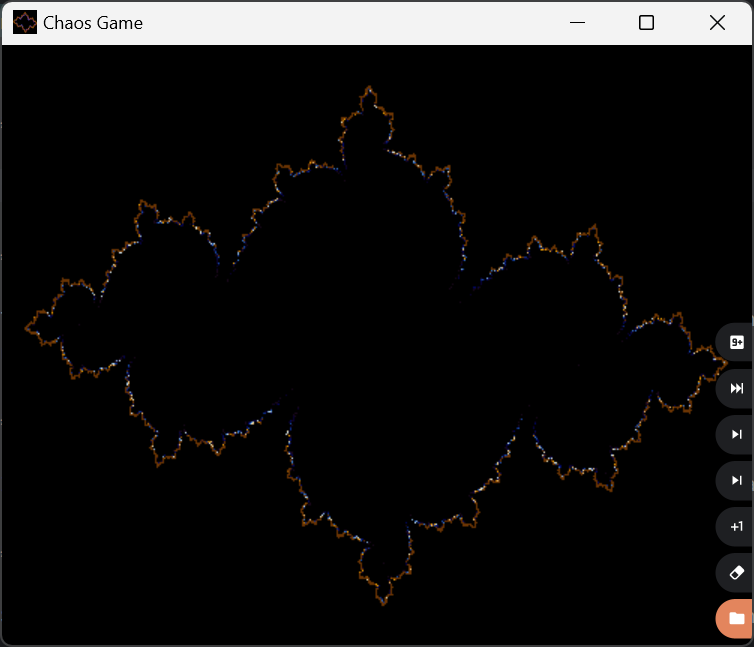
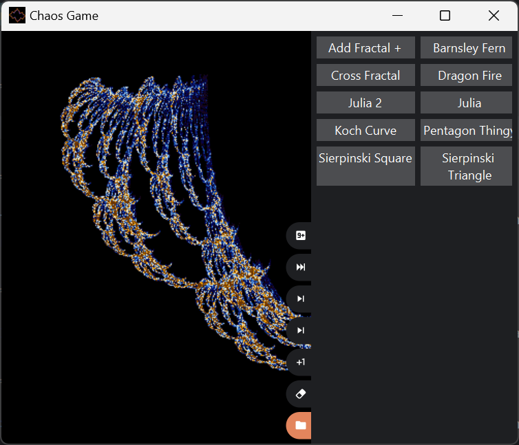
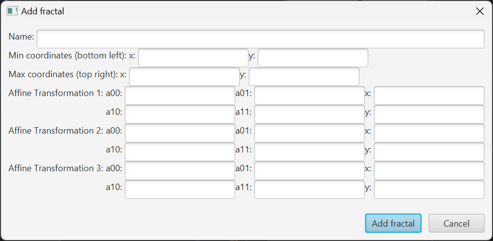

# JavaFX ChaosGame

ChaosGame is an application that allows you to generate fractals using affine transformations.
The program has a library of fractals that can be generated, and supports the creation of new ones.

## Installation

To install the project, simply clone the repository and open it in your favorite IDE.

```bash
git clone git@gitlab.stud.idi.ntnu.no:git-goblins/chaosgame.git
```

## Usage

To run the application, run

```bash
mvn clean javafx:run
```

or if you want to run the CLI version, run

```bash
mvn clean exec:java
```

## Visuals




